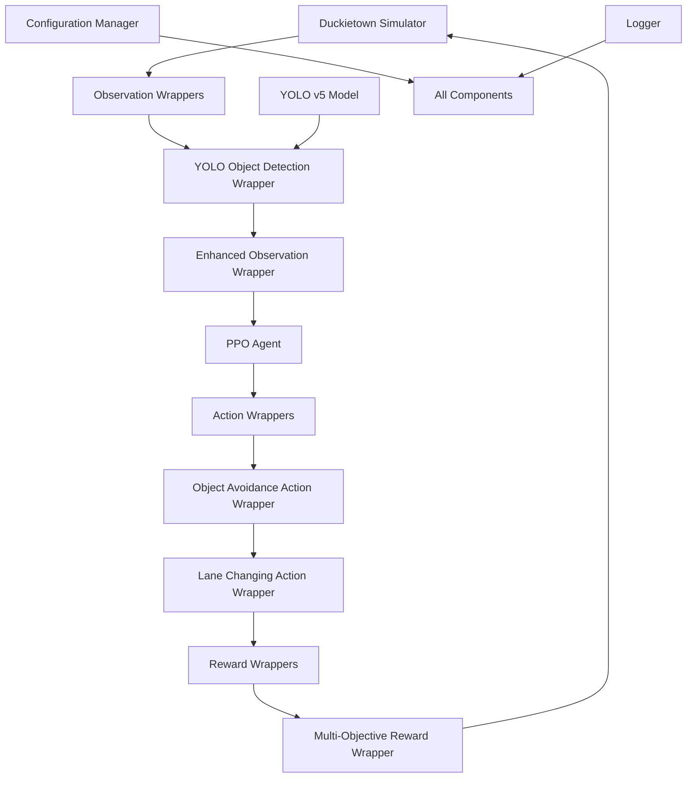
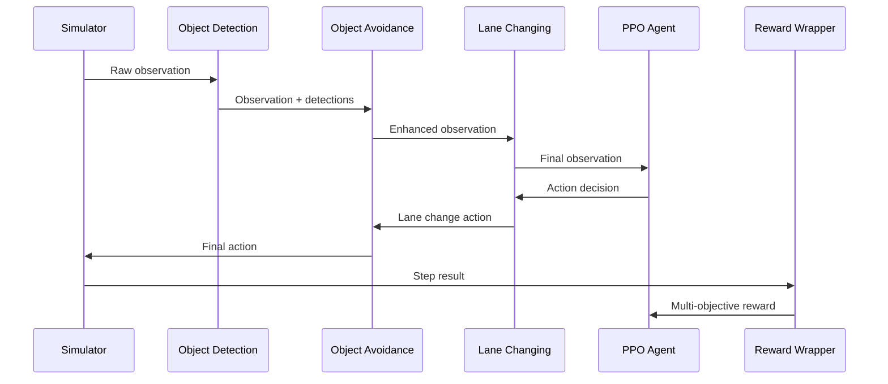
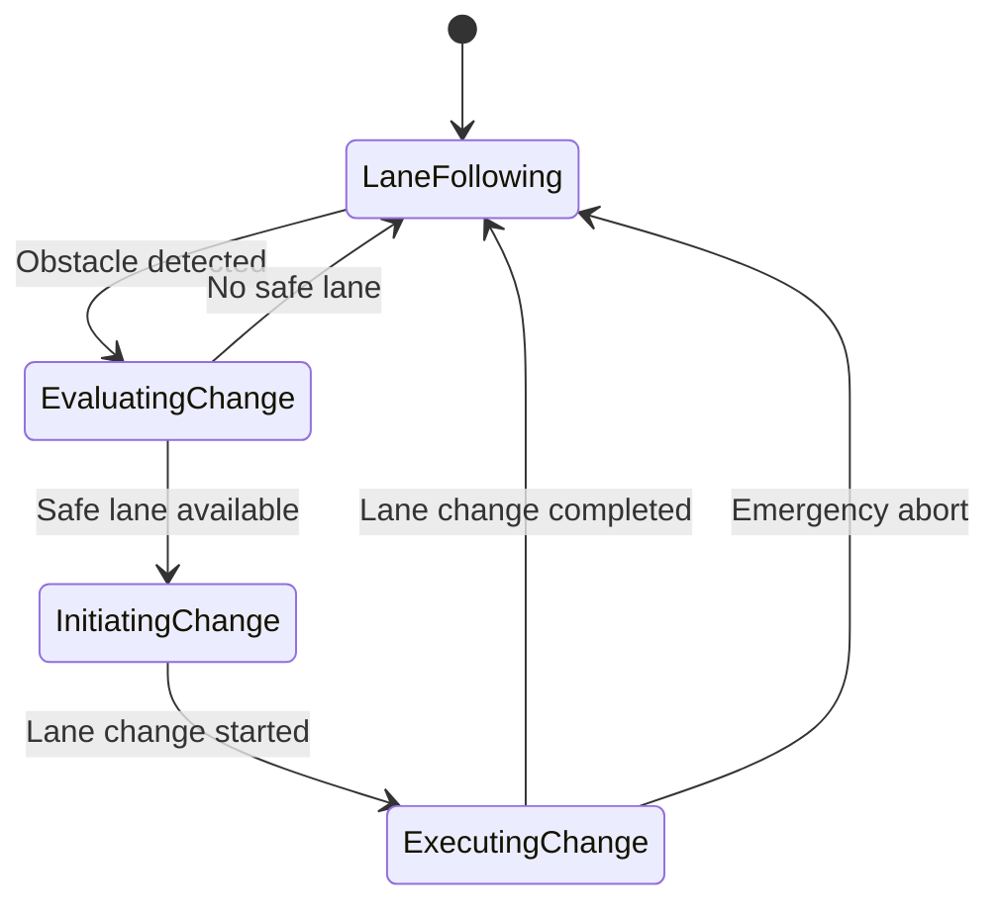
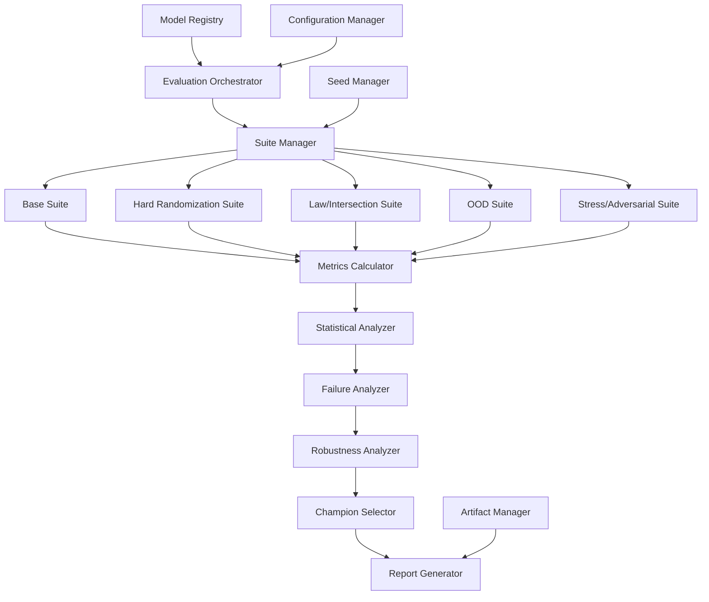
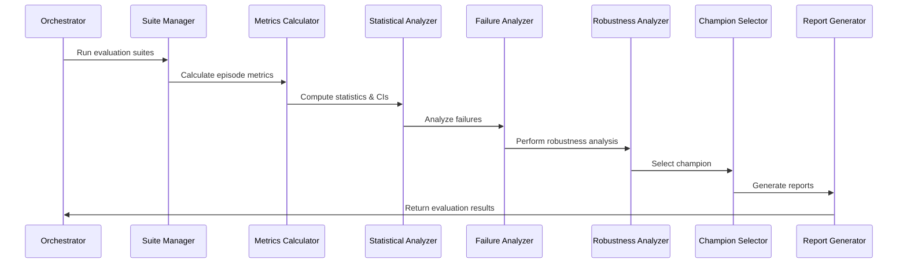

# Design Document

## Overview

The Enhanced Duckietown RL system extends the existing lane-following agent with advanced object detection and avoidance capabilities using YOLO v5, dynamic lane changing behaviors, and comprehensive integration with PPO training. The design maintains compatibility with the existing wrapper architecture while adding new layers of functionality for complex autonomous driving scenarios.

The system follows a modular wrapper-based architecture where each capability (object detection, avoidance, lane changing) is implemented as separate gym wrappers that can be composed together. This approach ensures maintainability, testability, and allows for selective feature activation during training and inference.

## Architecture

### High-Level System Architecture



### Component Interaction Flow



## Components and Interfaces

### 1. YOLO Object Detection Wrapper

**Purpose**: Integrates YOLO v5 object detection into the observation pipeline.

**Interface**:
```python
class YOLOObjectDetectionWrapper(gym.ObservationWrapper):
    def __init__(self, env, model_path: str, confidence_threshold: float = 0.5)
    def observation(self, observation: np.ndarray) -> Dict[str, Any]
```

**Key Features**:
- Real-time object detection using pre-trained YOLO v5 model
- Configurable confidence thresholds
- Bounding box extraction and object classification
- Integration with existing observation space
- Performance optimization for real-time processing

**Output Format**:
```python
{
    'image': np.ndarray,  # Original image
    'detections': [
        {
            'class': str,
            'confidence': float,
            'bbox': [x1, y1, x2, y2],
            'distance': float,  # Estimated distance
            'relative_position': [x, y]  # Relative to robot
        }
    ],
    'detection_count': int,
    'safety_critical': bool  # Any objects within safety distance
}
```

### 2. Object Avoidance Action Wrapper

**Purpose**: Modifies actions to avoid detected objects while maintaining lane following.

**Interface**:
```python
class ObjectAvoidanceActionWrapper(gym.ActionWrapper):
    def __init__(self, env, safety_distance: float = 0.5, avoidance_strength: float = 1.0)
    def action(self, action: np.ndarray) -> np.ndarray
```

**Key Features**:
- Potential field-based avoidance algorithm
- Configurable safety distances and avoidance strength
- Smooth action modifications to prevent jerky movements
- Priority-based avoidance for multiple objects
- Integration with existing action space

**Avoidance Algorithm**:
1. Calculate repulsive forces from detected objects
2. Apply attractive force toward lane center
3. Combine forces using weighted sum
4. Modify original action based on combined force vector
5. Apply smoothing to prevent oscillations

### 3. Lane Changing Action Wrapper

**Purpose**: Enables dynamic lane changing decisions based on obstacles and traffic conditions.

**Interface**:
```python
class LaneChangingActionWrapper(gym.ActionWrapper):
    def __init__(self, env, lane_change_threshold: float = 0.3, safety_margin: float = 2.0)
    def action(self, action: np.ndarray) -> np.ndarray
```

**Key Features**:
- Lane occupancy detection and analysis
- Safe lane change trajectory planning
- Multi-step lane change execution
- Fallback to current lane if unsafe
- State machine for lane change phases

**Lane Change State Machine**:


### 4. Enhanced Observation Wrapper

**Purpose**: Combines object detection results with traditional observations for the RL agent.

**Interface**:
```python
class EnhancedObservationWrapper(gym.ObservationWrapper):
    def __init__(self, env, include_detection_features: bool = True)
    def observation(self, observation: Dict) -> np.ndarray
```

**Key Features**:
- Flattens detection information into feature vector
- Maintains compatibility with existing observation space
- Configurable feature inclusion
- Normalization of detection features

**Feature Vector Components**:
- Original image features (flattened/encoded)
- Object presence indicators (per class)
- Closest object distance and bearing
- Lane occupancy status
- Safety critical flags

### 5. Multi-Objective Reward Wrapper

**Purpose**: Provides balanced rewards for lane following, object avoidance, and lane changing behaviors.

**Interface**:
```python
class MultiObjectiveRewardWrapper(gym.RewardWrapper):
    def __init__(self, env, reward_weights: Dict[str, float])
    def reward(self, reward: float) -> float
```

**Reward Components**:
- **Lane Following Reward**: Based on existing DtRewardPosAngle
- **Object Avoidance Reward**: Positive for maintaining safe distances
- **Lane Change Reward**: Positive for successful lane changes when needed
- **Efficiency Reward**: Encourages forward progress
- **Safety Penalty**: Negative for collisions or unsafe maneuvers

**Reward Calculation**:
```python
total_reward = (
    w_lane * lane_following_reward +
    w_avoid * object_avoidance_reward +
    w_change * lane_change_reward +
    w_efficiency * efficiency_reward +
    w_safety * safety_penalty
)
```

## Data Models

### Detection Data Structure
```python
@dataclass
class ObjectDetection:
    class_name: str
    confidence: float
    bbox: Tuple[int, int, int, int]  # x1, y1, x2, y2
    distance: float
    relative_position: Tuple[float, float]
    timestamp: float
    
@dataclass
class DetectionResult:
    detections: List[ObjectDetection]
    processing_time: float
    frame_id: int
    safety_critical: bool
```

### Lane Change State
```python
@dataclass
class LaneChangeState:
    current_phase: str  # 'following', 'evaluating', 'initiating', 'executing'
    target_lane: Optional[int]
    progress: float  # 0.0 to 1.0
    start_time: float
    safety_checks: Dict[str, bool]
    
@dataclass
class LaneInfo:
    lane_id: int
    occupancy: float  # 0.0 to 1.0
    safe_distance_ahead: float
    safe_distance_behind: float
```

### Configuration Schema
```python
@dataclass
class EnhancedRLConfig:
    # YOLO Configuration
    yolo_model_path: str
    yolo_confidence_threshold: float = 0.5
    yolo_device: str = 'cuda'
    
    # Object Avoidance Configuration
    safety_distance: float = 0.5
    avoidance_strength: float = 1.0
    min_clearance: float = 0.2
    
    # Lane Changing Configuration
    lane_change_threshold: float = 0.3
    safety_margin: float = 2.0
    max_lane_change_time: float = 3.0
    
    # Reward Configuration
    reward_weights: Dict[str, float]
    
    # Logging Configuration
    log_level: str = 'INFO'
    log_detections: bool = True
    log_actions: bool = True
    log_rewards: bool = True
```

## Error Handling

### Object Detection Errors
- **Model Loading Failures**: Fallback to basic obstacle detection using simulator data
- **Inference Timeouts**: Skip detection for current frame, use previous results
- **Memory Issues**: Reduce batch size or image resolution
- **GPU Unavailability**: Fallback to CPU inference with performance warning

### Action Wrapper Errors
- **Invalid Actions**: Clip to valid action space and log warning
- **Safety Violations**: Override with emergency stop action
- **Lane Change Failures**: Abort lane change and return to lane following

### Integration Errors
- **Wrapper Compatibility**: Validate wrapper order and compatibility at initialization
- **Configuration Errors**: Comprehensive validation with meaningful error messages
- **Runtime Exceptions**: Graceful degradation with logging

## Master Evaluation Orchestrator

### Evaluation Architecture

The Master Evaluation Orchestrator provides rigorous, reproducible evaluation of trained RL models across standardized test suites. It implements statistical rigor, comprehensive failure analysis, and automated champion selection.



### Core Evaluation Components

#### 1. Evaluation Orchestrator

**Purpose**: Coordinates evaluation execution across multiple models and suites.

**Interface**:
```python
class EvaluationOrchestrator:
    def __init__(self, config: EvaluationConfig)
    def evaluate_models(self, model_paths: List[str]) -> EvaluationResults
    def compare_with_champion(self, results: EvaluationResults) -> ComparisonReport
```

**Key Features**:
- Manages evaluation workflow across all test suites
- Ensures reproducible seed management
- Coordinates parallel evaluation execution
- Maintains evaluation state and progress tracking

#### 2. Suite Manager

**Purpose**: Manages different evaluation suites with standardized protocols.

**Test Suites**:
- **Base Suite**: Clean conditions, default parameters
- **Hard Randomization**: Heavy environmental noise, traffic
- **Law/Intersection**: Traffic rule compliance testing
- **Out-of-Distribution**: Unseen conditions, sensor noise
- **Stress/Adversarial**: Sensor failures, extreme conditions

**Interface**:
```python
class SuiteManager:
    def run_suite(self, suite_name: str, model: Model, seeds: List[int]) -> SuiteResults
    def get_suite_config(self, suite_name: str) -> SuiteConfig
```

#### 3. Metrics Calculator

**Purpose**: Computes comprehensive performance metrics with statistical rigor.

**Primary Metrics**:
- Success Rate (SR): % episodes completing without collision/off-lane
- Mean Reward (R): Normalized 0-1 reward
- Episode Length (L): Steps or lap time
- Lateral Deviation (D): Mean distance from lane center
- Heading Error (H): Mean angular deviation
- Smoothness (J): Mean absolute steering changes
- Stability (S): Reward consistency (μ/σ)

**Composite Score Calculation**:
```python
composite_score = (
    0.45 * success_rate +
    0.25 * normalized_reward +
    0.10 * normalized_episode_length +
    0.08 * (1 - normalized_lateral_deviation) +
    0.06 * (1 - normalized_heading_error) +
    0.06 * (1 - normalized_smoothness)
)
```

#### 4. Statistical Analyzer

**Purpose**: Provides rigorous statistical analysis with confidence intervals and significance testing.

**Statistical Methods**:
- Wilson 95% confidence intervals for proportions
- Bootstrap resampling (10k samples) for means
- Paired t-tests and Wilcoxon tests for comparisons
- Benjamini-Hochberg correction for multiple comparisons
- Effect size calculation (Cohen's d, Cliff's delta)

**Interface**:
```python
class StatisticalAnalyzer:
    def compute_confidence_intervals(self, data: np.ndarray) -> ConfidenceInterval
    def compare_models(self, model_a: Results, model_b: Results) -> ComparisonResult
    def correct_multiple_comparisons(self, p_values: List[float]) -> List[float]
```

#### 5. Failure Analyzer

**Purpose**: Comprehensive failure classification and diagnostic analysis.

**Failure Categories**:
- Collision (static/dynamic obstacles)
- Off-lane departure
- Stuck (insufficient progress)
- Oscillation (excessive steering changes)
- Over-speed violations
- Traffic rule violations
- Sensor glitches
- Slip/oversteer events

**Analysis Features**:
- Episode-level failure classification
- State trace capture and analysis
- Action histogram generation
- Lane deviation timeline tracking
- Video recording of worst episodes
- Spatial heatmap generation

#### 6. Robustness Analyzer

**Purpose**: Evaluates model sensitivity across environmental parameter sweeps.

**Robustness Testing Parameters**:
- Lighting intensity variations
- Texture domain shifts
- Camera pitch/roll angles
- Friction coefficient changes
- Wheel noise levels
- Spawn pose variations
- Traffic density levels

**Robustness Metrics**:
- Success Rate vs parameter curves
- Area Under Curve (AUC) robustness scores
- Sensitivity thresholds identification
- Operating range recommendations

#### 7. Champion Selector

**Purpose**: Automated model ranking and champion selection with statistical validation.

**Ranking Criteria** (in order):
1. Global Composite Score (primary)
2. Base Suite Success Rate
3. Lower Smoothness (tie-breaker)
4. Lower Lateral Deviation
5. Higher Stability
6. Higher OOD Success Rate
7. Shorter Episode Length

**Champion Validation**:
- ≥90% maps meet acceptance thresholds
- No map has Success Rate <75%
- Statistical significance vs current champion
- Pareto front analysis for trade-offs

### Data Models

#### Evaluation Configuration
```python
@dataclass
class EvaluationConfig:
    # Suite Configuration
    suites: List[str] = field(default_factory=lambda: ['base', 'hard', 'law', 'ood'])
    seeds_per_map: int = 50
    policy_modes: List[str] = field(default_factory=lambda: ['deterministic', 'stochastic'])
    
    # Metrics Configuration
    compute_ci: bool = True
    bootstrap_resamples: int = 10000
    significance_correction: str = 'benjamini_hochberg'
    
    # Scoring Configuration
    use_composite: bool = True
    normalization_scope: str = 'per_map_suite'
    pareto_axes: List[List[str]] = field(default_factory=lambda: [['SR', '-D', '-J']])
    
    # Artifact Configuration
    keep_top_k: int = 5
    export_csv_json: bool = True
    export_plots: bool = True
    record_videos: bool = True
    save_worst_k: int = 5
    
    # Reproducibility Configuration
    fix_seed_list: bool = True
    cudnn_deterministic: bool = True
    log_git_sha: bool = True
```

#### Episode Results Schema
```python
@dataclass
class EpisodeResult:
    run_id: str
    model_id: str
    mode: str  # 'deterministic' | 'stochastic'
    suite: str
    map_name: str
    seed: int
    success: bool
    collision: bool
    off_lane: bool
    violations: Dict[str, int]
    reward_mean: float
    lap_time_s: float
    deviation_m: float
    heading_deg: float
    jerk_mean: float
    stability_mu_over_sigma: float
    episode_len_steps: int
    video_path: Optional[str]
    trace_path: Optional[str]
    config_hash: str
    env_build: str
    timestamp: str
```

#### Evaluation Results
```python
@dataclass
class ModelEvaluationResults:
    model_id: str
    global_score: float
    global_score_ci: Tuple[float, float]
    suite_results: Dict[str, SuiteResults]
    pareto_rank: int
    champion_comparison: Optional[ComparisonResult]
    failure_analysis: FailureAnalysis
    robustness_analysis: RobustnessAnalysis
```

### Evaluation Workflow



## Testing Strategy

### Unit Testing
- **Individual Wrapper Testing**: Test each wrapper in isolation with mock environments
- **YOLO Integration Testing**: Validate object detection accuracy and performance
- **Action Modification Testing**: Verify action transformations maintain safety constraints
- **Reward Calculation Testing**: Validate multi-objective reward computation
- **Evaluation Component Testing**: Test metrics calculation, statistical analysis, and failure classification

### Integration Testing
- **Full Pipeline Testing**: Test complete wrapper stack with real simulator
- **Performance Testing**: Validate real-time processing requirements (>= 10 FPS)
- **Safety Testing**: Verify collision avoidance in various scenarios
- **Lane Change Testing**: Validate lane change execution and safety checks
- **End-to-End Evaluation Testing**: Test complete evaluation orchestrator workflow

### Scenario Testing
- **Static Obstacle Scenarios**: Test avoidance of stationary objects
- **Dynamic Obstacle Scenarios**: Test interaction with moving objects
- **Multi-Lane Scenarios**: Test lane changing in complex traffic situations
- **Edge Cases**: Test behavior at map boundaries, intersections, and tight spaces
- **Evaluation Suite Testing**: Validate all test suites produce expected results

### Performance Benchmarks
- **Detection Latency**: < 50ms per frame
- **Action Processing**: < 10ms per step
- **Memory Usage**: < 2GB GPU memory for YOLO inference
- **Training Stability**: Convergence within 1M timesteps
- **Evaluation Throughput**: Complete evaluation of 5 models across all suites within 4 hours

### Statistical Validation
- **Confidence Interval Accuracy**: Validate CI coverage using known distributions
- **Significance Test Reliability**: Test statistical power and Type I error rates
- **Multiple Comparison Correction**: Validate Benjamini-Hochberg implementation
- **Reproducibility Testing**: Ensure identical results with same seeds and configuration

### Logging and Debugging
- **Structured Logging**: JSON-formatted logs with timestamps and context
- **Performance Metrics**: Frame rates, processing times, memory usage
- **Decision Logging**: Action decisions, lane change reasoning, safety checks
- **Visualization Tools**: Real-time display of detections, actions, and rewards
- **Evaluation Logging**: Complete audit trail of evaluation execution and results

The design ensures modularity, maintainability, and extensibility while providing robust autonomous driving capabilities and rigorous evaluation infrastructure that builds upon the existing Duckietown RL framework.