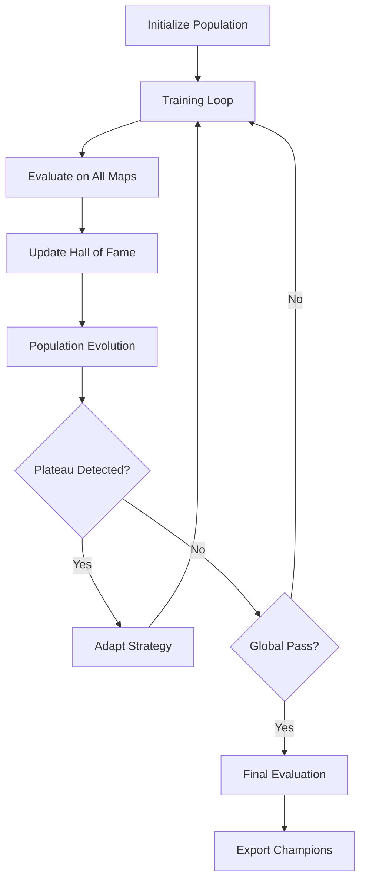

# 🏆 Master RL Training Orchestrator

**Continuous, Results-Oriented RL Training for Duckietown**

This system implements the master prompt for achieving state-of-the-art, stable performance across multiple Duckietown maps through continuous optimization, Population-Based Training (PBT), and rigorous evaluation.

## 🎯 Overview

The Master RL Orchestrator is designed to be **rigorous, data-driven, and relentless** about improving results while maintaining reproducibility. It implements a comprehensive training and evaluation pipeline that pushes RL agents to legendary performance levels.

### Key Features

- **🧬 Population-Based Training (PBT)**: Evolving population of agents with hyperparameter optimization
- **🗺️ Multi-Map Evaluation**: Comprehensive testing across diverse Duckietown environments
- **📊 Composite Scoring**: Advanced metrics combining success rate, precision, safety, and efficiency
- **🔄 Continuous Optimization**: Automated loops with plateau detection and adaptation
- **📈 Curriculum Learning**: Progressive difficulty with auto-advancement
- **🔥 Stress Testing**: Robustness evaluation under adverse conditions
- **⚖️ Pareto Optimization**: Multi-objective optimization with trade-off analysis
- **📋 Comprehensive Reporting**: Detailed analysis with visualizations and recommendations

## 🚀 Quick Start

### 1. Installation

```bash
# Clone the repository
git clone <your-repo>
cd duckietown-rl

# Install dependencies
pip install -r requirements.txt

# Setup enhanced environment
bash setup_enhanced_environment.sh
```

### 2. Launch with Default Configuration

```bash
# Start the master orchestrator
python launch_master_orchestrator.py

# Or with custom parameters
python launch_master_orchestrator.py --population-size 8 --max-loops 50
```

### 3. Create Custom Configuration

```bash
# Generate default config template
python launch_master_orchestrator.py --create-config my_config.yml

# Edit the configuration
vim my_config.yml

# Launch with custom config
python launch_master_orchestrator.py --config my_config.yml
```

## 📊 Success Criteria & Objectives

### Primary Objectives

The system targets specific success gates for different map types:

#### Easy Loop Maps (`loop_empty`, `small_loop`)
- **Success Rate**: ≥ 95%
- **Mean Reward**: ≥ 0.85 (normalized)
- **Lateral Deviation**: ≤ 0.12 m
- **Heading Error**: ≤ 8°
- **Smoothness/Jerk**: ≤ 0.08

#### Curvy Maps (`zigzag_dists`)
- **Success Rate**: ≥ 90%
- **Mean Reward**: ≥ 0.80
- **Lateral Deviation**: ≤ 0.15 m
- **Heading Error**: ≤ 10°
- **Smoothness/Jerk**: ≤ 0.10

#### Intersection/Town Maps (`4way`, `udem1`)
- **Success Rate**: ≥ 85%
- **Mean Reward**: ≥ 0.75
- **Lateral Deviation**: ≤ 0.20 m
- **Heading Error**: ≤ 12°
- **Traffic Violations**: < 3% episodes

### Global Pass Criteria

- **≥ 90%** of maps meet their individual thresholds
- **No map** below SR < 75%
- **Composite Score** > 85 (Champion level)

## 🔬 System Architecture

### Core Components

```
Master RL Orchestrator
├── Population-Based Training Engine
├── Multi-Map Evaluation System
├── Curriculum Learning Manager
├── Hyperparameter Evolution
├── Stress Testing Suite
├── Pareto Archive
├── Comprehensive Reporting
└── Model Export & Deployment
```

### Training Flow



## ⚙️ Configuration

### Key Configuration Sections

#### Population-Based Training
```yaml
population_based_training:
  enabled: true
  population_size: 8
  exploit_threshold: 0.25  # Bottom 25% killed
  explore_threshold: 0.25  # Top 25% cloned
  hyperparameter_ranges:
    lr: [1.0e-5, 1.0e-3]
    entropy_coef: [0.001, 0.03]
    clip_param: [0.1, 0.3]
```

#### Success Thresholds
```yaml
success_thresholds:
  easy_loop:
    sr_threshold: 0.95
    r_threshold: 0.85
    d_threshold: 0.12
    h_threshold: 8.0
    j_threshold: 0.08
```

#### Composite Scoring
```yaml
composite_score:
  sr_weight: 0.45      # Success Rate (45%)
  reward_weight: 0.25  # Mean Reward (25%)
  length_weight: 0.10  # Episode Length (10%)
  deviation_weight: 0.08  # Lateral Deviation (8%)
  heading_weight: 0.06    # Heading Error (6%)
  jerk_weight: 0.06      # Smoothness/Jerk (6%)
```

## 📈 Evaluation System

### Comprehensive Metrics

The evaluation system tracks detailed metrics across multiple dimensions:

#### Primary Metrics
- **Success Rate (SR)**: Percentage of episodes completed without collision/failure
- **Mean Reward (R)**: Normalized reward performance (0-1 scale)
- **Episode Length (L)**: Average episode duration
- **Lateral Deviation (D)**: Mean distance from lane center (meters)
- **Heading Error (H)**: Mean angular deviation from optimal heading (degrees)
- **Smoothness/Jerk (J)**: Mean steering change magnitude

#### Secondary Metrics
- **Stability**: Consistency of performance across episodes
- **Safety**: Collision rates, near-misses, traffic violations
- **Efficiency**: Fuel efficiency, time efficiency
- **Precision**: Lane accuracy, cornering performance

### Stress Testing

The system includes comprehensive stress tests:

- **Weather Stress**: Performance under rain, fog, lighting changes
- **Obstacle Stress**: Dynamic obstacles and unexpected situations  
- **Sensor Noise**: Robustness to sensor degradation
- **Domain Shift**: Generalization to unseen environments

## 🏆 Performance Levels

The system classifies agent performance into distinct levels:

| Level | Score Range | Description | Deployment Ready |
|-------|-------------|-------------|------------------|
| 🏆 **Legendary** | 95-100 | Perfect performance, competition-ready | ✅ Excellent |
| 🥇 **Grand Champion** | 90-94 | Outstanding performance, minimal failures | ✅ Excellent |
| 🥈 **Champion** | 85-89 | Strong performance, physical world ready | ✅ Ready |
| 🥉 **Expert** | 80-84 | Good performance, minor improvements needed | ⚠️ Almost Ready |
| 🏁 **Advanced** | 70-79 | Decent performance, needs more training | ❌ Not Ready |
| 🔰 **Developing** | <70 | Basic performance, significant training needed | ❌ Not Ready |

## 🔄 Optimization Loop

### Continuous Optimization Process

1. **Initialize Population**: Create diverse population with varied hyperparameters
2. **Training Phase**: Train each trial for K environment steps (2-5M per loop)
3. **Evaluation Phase**: Evaluate on all maps with fixed seeds (50 episodes/map)
4. **Archive Updates**: Update Hall of Fame and Pareto archive
5. **Population Evolution**: Kill bottom performers, clone top performers with perturbations
6. **Plateau Detection**: Monitor for performance plateaus and adapt strategy
7. **Strategy Adaptation**: Try alternative algorithms, adjust exploration, modify rewards

### Adaptation Strategies

When plateaus are detected:
- **Increase Exploration**: Boost entropy coefficients
- **Algorithm Switching**: Try SAC for some trials if PPO saturates
- **Reward Rebalancing**: Adjust reward component weights
- **Curriculum Advancement**: Increase environment difficulty
- **Hyperparameter Perturbation**: Larger perturbations for diversity

## 📊 Reporting & Analysis

### Automated Reports

The system generates comprehensive reports including:

- **Training Progress**: Learning curves, performance trends
- **Map-Specific Analysis**: Per-map performance breakdown
- **Population Evolution**: Hyperparameter evolution over time
- **Pareto Analysis**: Trade-off visualization (SR vs Deviation vs Jerk)
- **Stress Test Results**: Robustness evaluation summary
- **Failure Analysis**: Common failure modes and recommendations

### Visualization Dashboard

Real-time monitoring includes:
- Population performance distribution
- Hall of Fame rankings
- Pareto front evolution
- Training efficiency metrics
- Resource utilization

## 🚀 Deployment & Export

### Model Export Formats

Champions are exported in multiple formats:
- **PyTorch**: Native format for continued training
- **ONNX**: Cross-platform deployment
- **JSON**: Hyperparameters and configuration
- **TensorRT**: Optimized inference (if GPU available)

### Deployment Packages

- **Docker Containers**: Containerized deployment
- **ROS Packages**: Robot Operating System integration
- **Standalone Executables**: Self-contained deployment

## 🛠️ Advanced Usage

### Custom Algorithms

Add new algorithms by extending the base configuration:

```yaml
algorithm:
  custom_sac:
    lr: 3.0e-4
    gamma: 0.99
    tau: 0.005
    alpha: 0.2
    automatic_entropy_tuning: true
```

### Custom Maps

Add new evaluation maps:

```yaml
target_maps:
  - name: "my_custom_map"
    difficulty: "expert"
    type: "custom"
    success_thresholds:
      sr_threshold: 0.80
      r_threshold: 0.70
```

### Custom Metrics

Extend the evaluation system with custom metrics:

```python
class CustomEvaluationSystem(MasterEvaluationSystem):
    def _calculate_custom_metric(self, episode_data):
        # Your custom metric calculation
        return custom_score
```

## 🔧 Troubleshooting

### Common Issues

#### Training Instability
- Reduce learning rates across population
- Increase batch sizes
- Add gradient clipping
- Check reward scaling

#### Poor Convergence
- Extend training duration
- Adjust curriculum progression
- Increase population diversity
- Check environment setup

#### Memory Issues
- Reduce batch sizes
- Decrease population size
- Use gradient accumulation
- Enable memory optimization

#### Evaluation Inconsistency
- Verify seed management
- Check environment determinism
- Validate metric calculations
- Review evaluation protocol

### Performance Optimization

#### CPU Optimization
```yaml
system:
  num_cpus: 0  # Use all available
  parallel_trials: 4
  memory_limit_gb: 16
```

#### GPU Optimization (if available)
```yaml
system:
  num_gpus: 1
  gpu_memory_fraction: 0.8
  mixed_precision: true
```

## 📚 References & Citations

This implementation is based on:

- **Population-Based Training**: [Jaderberg et al., 2017](https://arxiv.org/abs/1711.09846)
- **Multi-Objective RL**: [Roijers & Whiteson, 2017](https://www.jmlr.org/papers/v18/15-047.html)
- **Curriculum Learning**: [Bengio et al., 2009](https://dl.acm.org/doi/10.1145/1553374.1553380)
- **Duckietown**: [Paull et al., 2017](https://ieeexplore.ieee.org/document/7989179)

## 🤝 Contributing

We welcome contributions! Please see our [Contributing Guide](CONTRIBUTING.md) for details.

### Development Setup

```bash
# Install development dependencies
pip install -r requirements-dev.txt

# Run tests
python -m pytest tests/

# Run linting
flake8 .
black .
```

## 📄 License

This project is licensed under the MIT License - see the [LICENSE](LICENSE) file for details.

## 🙏 Acknowledgments

- Duckietown community for the simulation environment
- OpenAI for PPO implementation insights
- DeepMind for Population-Based Training methodology
- The broader RL research community

---

**🏆 Ready to achieve legendary performance? Launch the Master RL Orchestrator and push the boundaries of autonomous driving!**