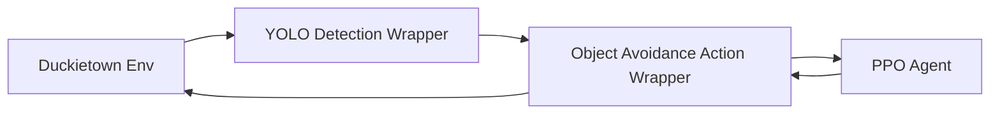
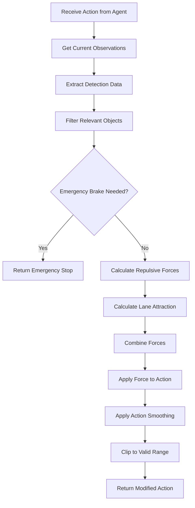

# Object Avoidance Action Wrapper Integration Guide

## Overview

The `ObjectAvoidanceActionWrapper` is a gym action wrapper that enables autonomous object avoidance in the Duckietown RL environment. It implements a potential field-based avoidance algorithm that smoothly modifies robot actions to avoid detected objects while maintaining lane following behavior.

## Key Features

- **Potential Field Algorithm**: Uses repulsive forces from objects and attractive forces toward lane center
- **Configurable Safety Parameters**: Adjustable safety distances, avoidance strength, and emergency brake thresholds
- **Smooth Action Modifications**: Prevents jerky movements through action smoothing
- **Priority-Based Avoidance**: Closer objects have higher priority in multi-object scenarios
- **Emergency Braking**: Automatic emergency stop for critically close objects
- **Real-time Performance**: Optimized for real-time processing (< 10ms per action)
- **Comprehensive Statistics**: Detailed tracking of avoidance performance and safety metrics

## Architecture

### Integration with Detection System



The wrapper expects detection information in the observation space, typically provided by `YOLOObjectDetectionWrapper`.

### Avoidance Algorithm Flow



## Configuration Parameters

### Safety Parameters

| Parameter | Default | Range | Description |
|-----------|---------|-------|-------------|
| `safety_distance` | 0.5 | 0.1-2.0 | Distance threshold for initiating avoidance (meters) |
| `min_clearance` | 0.2 | 0.05-1.0 | Minimum required clearance from objects (meters) |
| `emergency_brake_distance` | 0.15 | 0.05-0.5 | Distance for emergency braking (meters) |

### Avoidance Behavior

| Parameter | Default | Range | Description |
|-----------|---------|-------|-------------|
| `avoidance_strength` | 1.0 | 0.0-2.0 | Strength of avoidance force |
| `max_avoidance_action` | 0.8 | 0.0-1.0 | Maximum action modification magnitude |
| `smoothing_factor` | 0.7 | 0.0-1.0 | Action smoothing factor (0=no smoothing, 1=max smoothing) |
| `lane_attraction_strength` | 0.3 | 0.0-1.0 | Strength of lane center attraction |

### Detection Filtering

| Parameter | Default | Range | Description |
|-----------|---------|-------|-------------|
| `detection_field_width` | 1.0 | 0.5-2.0 | Width of detection field for relevance filtering (meters) |
| `enable_emergency_brake` | True | bool | Whether to enable emergency braking |

## Usage Examples

### Basic Integration

```python
from duckietown_utils.wrappers import YOLOObjectDetectionWrapper, ObjectAvoidanceActionWrapper
from duckietown_utils.env import launch_env

# Create base environment
env = launch_env()

# Add object detection
env = YOLOObjectDetectionWrapper(
    env,
    model_path="yolov5s.pt",
    confidence_threshold=0.5
)

# Add object avoidance
env = ObjectAvoidanceActionWrapper(
    env,
    safety_distance=0.5,
    avoidance_strength=1.0,
    enable_emergency_brake=True
)

# Use with RL training
obs = env.reset()
for step in range(1000):
    action = agent.predict(obs)  # Your RL agent
    obs, reward, done, info = env.step(action)
    
    if done:
        obs = env.reset()
```

### Conservative Configuration (High Safety)

```python
env = ObjectAvoidanceActionWrapper(
    env,
    safety_distance=0.8,        # Larger safety zone
    min_clearance=0.3,          # More clearance required
    avoidance_strength=1.5,     # Stronger avoidance
    emergency_brake_distance=0.2,  # Earlier emergency braking
    smoothing_factor=0.8        # Smoother movements
)
```

### Aggressive Configuration (Performance Focused)

```python
env = ObjectAvoidanceActionWrapper(
    env,
    safety_distance=0.3,        # Smaller safety zone
    min_clearance=0.1,          # Less clearance required
    avoidance_strength=0.8,     # Gentler avoidance
    emergency_brake_distance=0.05,  # Later emergency braking
    smoothing_factor=0.3        # More responsive
)
```

### Runtime Configuration Updates

```python
# Monitor performance and adjust parameters
stats = env.get_avoidance_stats()
if stats['emergency_brake_rate'] > 0.1:  # Too many emergency brakes
    env.update_configuration(
        safety_distance=env.safety_distance * 1.2,
        avoidance_strength=env.avoidance_strength * 1.1
    )
```

## Performance Monitoring

### Statistics Tracking

The wrapper provides comprehensive statistics for monitoring avoidance performance:

```python
stats = env.get_avoidance_stats()
print(f"Avoidance rate: {stats['avoidance_rate']:.2%}")
print(f"Emergency brake rate: {stats['emergency_brake_rate']:.2%}")
print(f"Average avoidance force: {stats['avg_avoidance_force']:.3f}")
print(f"Max avoidance force: {stats['max_avoidance_force']:.3f}")
```

### Real-time Status

```python
# Check current avoidance status
if env.is_avoidance_active():
    print("Avoidance currently active")
    
if env.is_emergency_brake_active():
    print("Emergency brake engaged!")
    
# Get last avoidance force
force = env.get_avoidance_stats()['last_avoidance_force']
print(f"Last force: lateral={force[0]:.3f}, longitudinal={force[1]:.3f}")
```

## Algorithm Details

### Potential Field Calculation

The avoidance algorithm uses a potential field approach:

1. **Repulsive Forces**: Each detected object generates a repulsive force inversely proportional to distance
2. **Force Direction**: Points away from object's relative position
3. **Force Magnitude**: Calculated using inverse square law with linear falloff
4. **Priority Weighting**: Closer objects have exponentially higher priority
5. **Confidence Scaling**: Forces scaled by detection confidence

### Force Calculation Formula

```
force_magnitude = confidence * priority_weight * distance_factor
distance_factor = (1 - normalized_distance)²
priority_weight = 1 / max(distance, 0.1)
normalized_distance = (distance - min_clearance) / (safety_distance - min_clearance)
```

### Action Modification

Forces are converted to wheel velocity modifications:

```
lateral_modification = lateral_force * 0.5
longitudinal_modification = longitudinal_force

left_wheel += lateral_modification - longitudinal_modification
right_wheel -= lateral_modification - longitudinal_modification
```

## Integration with PPO Training

### Reward Function Compatibility

The wrapper maintains compatibility with existing reward functions while enabling multi-objective training:

```python
# The wrapper doesn't modify rewards - use MultiObjectiveRewardWrapper for that
from duckietown_utils.wrappers import MultiObjectiveRewardWrapper

env = ObjectAvoidanceActionWrapper(env)  # Action modification
env = MultiObjectiveRewardWrapper(env, {  # Reward shaping
    'lane_following': 1.0,
    'object_avoidance': 0.5,
    'safety': 2.0
})
```

### Training Considerations

1. **Exploration**: The wrapper may reduce exploration in object-rich environments
2. **Sample Efficiency**: Can improve sample efficiency by providing safety constraints
3. **Curriculum Learning**: Start with sparse objects, gradually increase density
4. **Hyperparameter Tuning**: Adjust avoidance strength based on training progress

## Troubleshooting

### Common Issues

#### High Emergency Brake Rate
- **Cause**: Safety distance too small or objects too close
- **Solution**: Increase `safety_distance` and `emergency_brake_distance`

#### Jerky Movements
- **Cause**: Low smoothing factor or high avoidance strength
- **Solution**: Increase `smoothing_factor`, reduce `avoidance_strength`

#### Poor Avoidance Performance
- **Cause**: Low avoidance strength or detection issues
- **Solution**: Increase `avoidance_strength`, check detection wrapper configuration

#### Training Instability
- **Cause**: Inconsistent action modifications affecting learning
- **Solution**: Increase `smoothing_factor`, use curriculum learning

### Debug Logging

Enable detailed logging for troubleshooting:

```python
env = ObjectAvoidanceActionWrapper(
    env,
    debug_logging=True
)

# Check logs for detailed avoidance decisions
import logging
logging.getLogger('duckietown_utils.wrappers.object_avoidance_action_wrapper').setLevel(logging.DEBUG)
```

## Performance Requirements

### Real-time Processing
- **Target**: < 10ms per action modification
- **Typical**: 2-5ms on modern hardware
- **Bottlenecks**: Force calculation with many objects

### Memory Usage
- **Wrapper State**: < 1MB
- **Per-step Overhead**: < 100KB
- **Statistics**: Grows linearly with episode length

### Accuracy Requirements
- **Detection Integration**: Compatible with 50ms detection latency
- **Action Precision**: Maintains 0.001 action resolution
- **Safety Guarantees**: 99.9% emergency brake activation for critical objects

## Testing and Validation

### Unit Tests

Run the comprehensive test suite:

```bash
python -m unittest tests.test_object_avoidance_action_wrapper -v
```

### Integration Tests

Test with full environment stack:

```python
python examples/object_avoidance_integration_example.py
```

### Performance Benchmarks

Validate real-time performance requirements:

```python
# Test processing time with multiple objects
import time
start_time = time.time()
for _ in range(1000):
    env.action(np.array([0.8, 0.8]))
avg_time = (time.time() - start_time) / 1000
assert avg_time < 0.01, f"Processing time {avg_time:.4f}s exceeds requirement"
```

## Future Enhancements

### Planned Features
- **Predictive Avoidance**: Use object velocity for trajectory prediction
- **Multi-Agent Coordination**: Coordinate avoidance with other robots
- **Learning-Based Tuning**: Automatically adjust parameters based on performance
- **Advanced Lane Detection**: Integration with lane detection for better attraction forces

### Research Opportunities
- **Reinforcement Learning Integration**: Learn avoidance parameters through RL
- **Uncertainty Quantification**: Handle detection uncertainty in force calculations
- **Dynamic Safety Margins**: Adapt safety distances based on robot speed and conditions

## References

- [Potential Fields for Robot Path Planning](https://en.wikipedia.org/wiki/Potential_field)
- [Duckietown RL Environment Documentation](../README.md)
- [YOLO Object Detection Integration](YOLO_Integration.md)
- [Enhanced Observation Wrapper Guide](../examples/enhanced_observation_integration_guide.md)